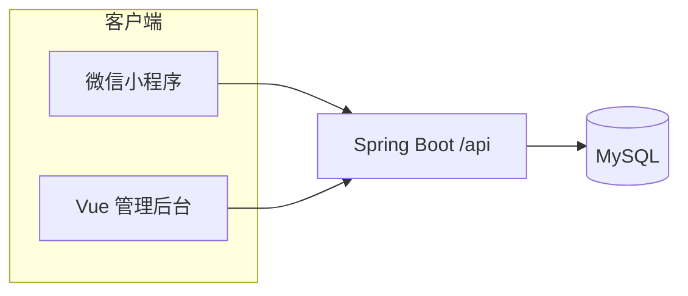

# 若冰代码手册（RuoBing Codebook）— 源码结构说明

> 本文档按 **Web 管理端（`web/`）**、**后端（`backend/`）**、**微信小程序（`mini-program/`）** 梳理主要文件职责，并补充根目录与数据库相关文件。  
> 生成日期：2026-04-12  

---

## 1. 项目总览

| 子项目 | 目录 | 技术栈 | 说明 |
|--------|------|--------|------|
| 管理后台 | `web/` | Vue 3 + Vite + Element Plus + ECharts + Axios | PC 端内容管理与数据看板，开发端口 **3000** |
| 后端 API | `backend/` | Spring Boot 2.7 + MyBatis-Plus + MySQL + Knife4j | REST 接口，`context-path` 为 **`/api`**，默认端口 **4001**（见 `application.yml`） |
| 小程序 | `mini-program/` | 原生微信小程序 | 用户端浏览、轮播、主题、登录与个人资料等 |

**请求路径约定：** 浏览器/Vite 访问 `http://localhost:3000`，通过代理将 `/api` 转发到 `http://localhost:4001`；小程序在 `app.js` 的 `globalData.apiBase` 中配置完整 API 根地址（如 `http://localhost:4001/api`）。

---

## 2. 后端 `backend/`

### 2.1 构建与启动脚本

| 文件 | 功能 |
|------|------|
| `pom.xml` | Maven 工程定义：Spring Boot 2.7.18、JDK 17、MyBatis-Plus、MySQL、Redis、JWT、Validation、Knife4j（Swagger）等依赖与打包配置 |
| `start.bat` / `restart_backend.bat` / `_restart.bat` | Windows 下启动或重启后端服务的批处理脚本 |
| `_start.ps1` | PowerShell 启动脚本 |

### 2.2 入口与配置

| 文件 | 功能 |
|------|------|
| `src/main/java/.../CodebookApplication.java` | Spring Boot 主启动类 |
| `src/main/resources/application.yml` | 主配置：端口 **4001**、`context-path: /api`、激活 profile、MyBatis-Plus 全局（含逻辑删除）、JWT、Knife4j |
| `src/main/resources/application-dev.yml` | 开发环境数据源等覆盖配置 |
| `src/main/resources/application-prod.yml` | 生产环境覆盖配置 |

### 2.3 通用与全局处理

| 文件 | 功能 |
|------|------|
| `common/Result.java` | 统一 JSON 响应封装（`code`、`msg`、`data`） |
| `common/PageResult.java` | 分页列表封装（`records`、`total`、页码等） |
| `common/GlobalExceptionHandler.java` | 全局异常处理，将异常转为统一 `Result` 或 HTTP 状态 |

### 2.4 框架配置

| 文件 | 功能 |
|------|------|
| `config/CorsConfig.java` | 跨域（CORS）配置，允许管理端与小程序来源访问 API |
| `config/MybatisPlusConfig.java` | MyBatis-Plus 分页插件等扩展配置 |
| `config/SwaggerConfig.java` | OpenAPI 3 / Knife4j 文档与分组配置 |

### 2.5 控制器层 `controller/`

| 文件 | 功能（路由前缀均在 `/api` 之下） |
|------|----------------------------------|
| `IndexController.java` | 根路径 `/`：返回纯文本服务状态提示 |
| `WebDesignController.java` | `/web-design`：列表（关键词、排序、分页）、热门、最新、详情、新增/更新（`POST` 体带 id 则更新）、删除 |
| `GraduationProjectController.java` | `/graduation`：与网页设计类似的列表/热门/最新/详情/保存/删除 |
| `BannerController.java` | `/banner`：轮播图列表、全量、增删改（管理） |
| `FeedbackController.java` | `/feedback`：提交反馈、列表、按 id 回复 |
| `ChangelogController.java` | `/changelog`：更新日志列表（`/list`） |
| `AboutUsController.java` | `/about`：`GET` 获取关于我们、`PUT` 更新 |
| `SysUserController.java` | `/sys-user`：管理后台用户 CRUD、状态、统计等 |
| `UserController.java` | `/user`：小程序微信登录、按 id/ openid 查询与更新资料 |
| `FeedbackController.java` | 见上 |

### 2.6 业务层 `service/`

| 文件 | 功能 |
|------|------|
| `WebDesignService.java` | 网页设计分页查询、热门/最新筛选、详情（含浏览量自增）、保存（有 id 则更新）、删除 |
| `GraduationProjectService.java` | 毕业设计业务逻辑，与网页设计对称 |
| `BannerService.java` | 轮播图业务逻辑 |
| `FeedbackService.java` | 反馈提交、列表、回复处理 |
| `ChangelogService.java` | 更新日志查询列表 |
| `AboutUsService.java` | 关于我们读写 |
| `SysUserService.java` | 系统用户管理与统计 |
| `UserService.java` | 小程序用户：微信 code 换 openid、注册/更新资料等 |

### 2.7 数据访问层 `repository/`

各 `*Repository.java` 继承 MyBatis-Plus `BaseMapper`，对应实体表的基础 CRUD；无 XML 时以注解/默认 SQL 为主。

| 文件 | 对应实体/表 |
|------|----------------|
| `WebDesignRepository.java` | `web_design` |
| `GraduationProjectRepository.java` | `graduation_project` |
| `BannerRepository.java` | `banner` |
| `FeedbackRepository.java` | `feedback` |
| `ChangelogRepository.java` | `changelog` |
| `AboutUsRepository.java` | `about_us` |
| `SysUserRepository.java` | `sys_user` |
| `UserRepository.java` | `user`（小程序用户） |

### 2.8 实体层 `entity/`

| 文件 | 功能 |
|------|------|
| `WebDesign.java` | 网页设计作品字段（标题、描述、封面、标签、浏览/点赞、链接、状态等） |
| `GraduationProject.java` | 毕业设计项目实体 |
| `Banner.java` | 首页轮播（图片、跳转类型、关联 id、排序、状态等） |
| `Feedback.java` | 用户反馈 |
| `Changelog.java` | 版本更新日志 |
| `AboutUs.java` | 关于我们单页内容 |
| `SysUser.java` | 管理后台账号（用户名、密码、角色、状态等） |
| `User.java` | 小程序用户（openid、昵称、头像等） |

### 2.9 SQL 与样例数据

| 文件 | 功能 |
|------|------|
| `mock_graduation.sql` | 毕业设计相关示例/初始化数据（如有） |
| `mock_web_design.sql` | 网页设计示例数据（如有） |

---

## 3. Web 前端 `web/`

### 3.1 工程入口与构建

| 文件 | 功能 |
|------|------|
| `package.json` | 依赖：Vue 3、Vue Router、Element Plus、Axios、ECharts、Vite；脚本 `dev` / `build` / `preview` |
| `package-lock.json` | 锁定依赖版本 |
| `vite.config.js` | Vite：Vue 插件、`@` → `src` 别名、开发服务器端口 **3000**、`/api` 代理到 **http://localhost:4001** |
| `index.html` | HTML 入口，挂载 `#app` |

### 3.2 源码 `src/`

| 文件 | 功能 |
|------|------|
| `main.js` | 创建 Vue 应用：注册 Element Plus、全局图标、`router`、挂载根组件 |
| `App.vue` | 根组件：`el-config-provider` 中文语言包 + `<router-view />` |
| `router/index.js` | 路由：`/login`；`/` 下子路由包含 `home`、`web-design`、`graduation`、`feedback`、`changelog`、`sys-user`、`about` 及对应编辑页 |

### 3.3 接口与请求

| 文件 | 功能 |
|------|------|
| `utils/request.js` | Axios 实例：`baseURL: '/api'`，响应拦截直接返回 `response.data`，错误时 `ElMessage` |
| `api/index.js` | 封装各模块 API：`webDesignApi`、`graduationApi`、`feedbackApi`、`changelogApi`、`aboutApi`、`sysUserApi`（路径与后端 `/about`、`/sys-user` 等一致） |

### 3.4 页面视图 `views/`

| 文件 | 功能 |
|------|------|
| `Login.vue` | 管理端登录页：本地校验密钥（如 `admin123`），写入 `localStorage` 后跳转 |
| `Layout.vue` | 后台布局：侧栏菜单 + 顶栏，嵌套子路由 |
| `Home.vue` | 首页数据看板：统计卡片、ECharts 图表（趋势、分布、排行等），聚合多接口数据展示 |
| `WebDesign.vue` | 网页设计列表与管理入口 |
| `WebDesignEdit.vue` | 网页设计表单编辑，提交调用 `webDesignApi.save`（依赖后端 save 内根据 id 判断新增/更新） |
| `Graduation.vue` | 毕业设计列表 |
| `GraduationEdit.vue` | 毕业设计编辑表单 |
| `Feedback.vue` | 用户反馈列表与处理 |
| `Changelog.vue` | 更新日志列表与「新增版本」对话框（前端调用 `changelogApi.save`，需与后端实际暴露接口一致） |
| `About.vue` | 关于我们内容编辑 |
| `SysUser.vue` | 系统用户管理：列表、搜索、分页、状态、重置密码等 |

---

## 4. 微信小程序 `mini-program/`

### 4.1 全局配置

| 文件 | 功能 |
|------|------|
| `app.js` | 全局 `globalData`：`apiBase`、主题列表 `THEMES`、用户信息、`request` 引用；`onLaunch` 恢复主题；`setTheme` / `applyThemeToPage` / `updateTabBar` 实现多主题与 TabBar 图标切换 |
| `app.json` | 小程序名称、页面路径列表、**tabBar** 四项（首页、网页设计、毕业设计、我的）、窗口默认样式 |
| `app.wxss` | 全局样式（常配合 CSS 变量与主题 class） |
| `sitemap.json` | 微信索引与爬取相关配置 |

### 4.2 工具

| 文件 | 功能 |
|------|------|
| `utils/request.js` | 封装 `wx.request`：`get/post/put/delete`，URL 拼接 `globalData.apiBase` |

### 4.3 页面（每个页面通常包含 `.js` 逻辑、`.wxml` 结构、`.wxss` 样式、`.json` 页面配置）

| 目录/页面 | 功能 |
|-----------|------|
| `pages/index/` | **首页**：拉取轮播、网页/毕业设计热门与最新，合并展示；主题样式；跳转详情 |
| `pages/web-view/` | **内置网页**：`web-view` 打开外部或 H5 链接 |
| `pages/web-design/list` | 网页设计列表（搜索、分页等与后端一致） |
| `pages/web-design/detail` | 网页设计详情（浏览量、标签、外链等） |
| `pages/graduation/list` | 毕业设计列表 |
| `pages/graduation/detail` | 毕业设计详情 |
| `pages/mine/mine` | **我的**：展示登录状态、入口到登录/资料/主题等；退出登录 |
| `pages/mine/login` | 微信登录流程，与 `/user/login` 等接口配合 |
| `pages/mine/profile` | 个人资料编辑与展示 |
| `pages/mine/feedback` | 意见反馈提交 |
| `pages/mine/changelog` | 客户端查看更新日志 |
| `pages/mine/about` | 关于我们 |
| `pages/mine/theme` | 主题选择页，调用 `app.setTheme` |

### 4.4 静态资源

| 目录 | 功能 |
|------|------|
| `static/tabbar/` | TabBar 默认与 **按主题色区分的选中图标**（如 `home-blue.png`）；部分 `generate_*.py` 用于批量生成图标 |
| `static/icons/` | 「我的」等功能入口小图标；含生成脚本 |
| `static/section_icons/` | 列表分区用的 SVG/图标资源；含下载或生成脚本 |
| `static/banners/` | 首页轮播相关静态图；含 `gen_banners.py` |
| `static/default-avatar.png` | 默认头像占位图 |

---

## 5. 数据库 `database/`

| 文件 | 功能 |
|------|------|
| `schema.sql` | MySQL 表结构创建脚本（库名、表字段以脚本为准） |
| `init_db.py` | Python 初始化脚本：可插入种子数据或执行额外初始化逻辑 |

---

## 6. 仓库根目录其他文件

| 文件 | 功能 |
|------|------|
| `project.config.json` | 微信开发者工具项目配置（注意：其中 `miniprogramRoot` 若指向 `./miniprogram`，需与实际目录 `mini-program/` 保持一致，否则需在工具中改目录） |
| `create_sys_user.sql` | 创建或初始化 `sys_user` 管理账号的 SQL |
| `CHANGELOG.md` | 项目变更记录 |

---

## 7. 模块依赖关系（简图）

---

## 8. 文档与延伸阅读

| 文件 | 说明 |
|------|------|
| `docs/README.md` | 项目汇总、架构、API 表、启动步骤与历史问题记录 |
| `docs/DEV.md` | 开发手册（部分路径描述可能与当前目录名 `web/` 不一致，以实际仓库为准） |

---

*若个别前端接口（如更新日志 `POST`）与后端控制器未完全对齐，以运行时代码与 Swagger（`/doc.html` 或项目配置的 Knife4j 路径）为准进行联调。*
